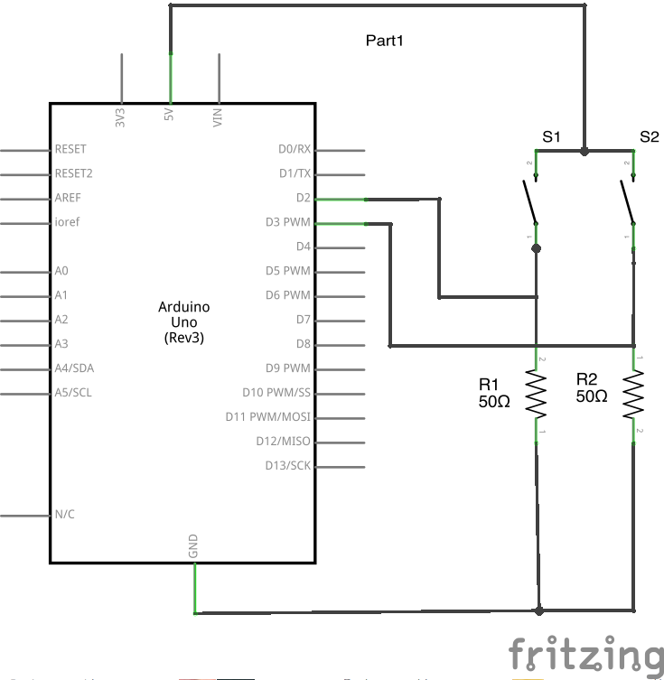

BBQuiz
===================

BBQuiz was developed for a Quiz Show using an Arduino Duemilanove and pushbutton switches interfaced with HTML + Javascript as a GUI. It uses [BreakoutServer](https://github.com/soundanalogous/Breakout) and AdvancedFirmata developed by Jeff Hoefs for communication between the Arduino and the HTML/Javascript GUI.

Setup
------

1. Make sure Arduino hardware (schematic to be uploaded) has been loaded with the AdvancedFirmata code in the firmware folder. Make sure to use the following the schematic:

2. Open appropriate 'Breakout Server' in 'server' folder. Open connection to QuizApp hardware by clicking Connect. Something like this should appear:

        Breakout Server v0.2.3
        
        Server running on: http://computer-name:8887/
        Connected to IOBoard on: /dev/cu.usbserial-#######

3. Open BBQuiz.html in browser of choice switch to presentation or full screen mode.
